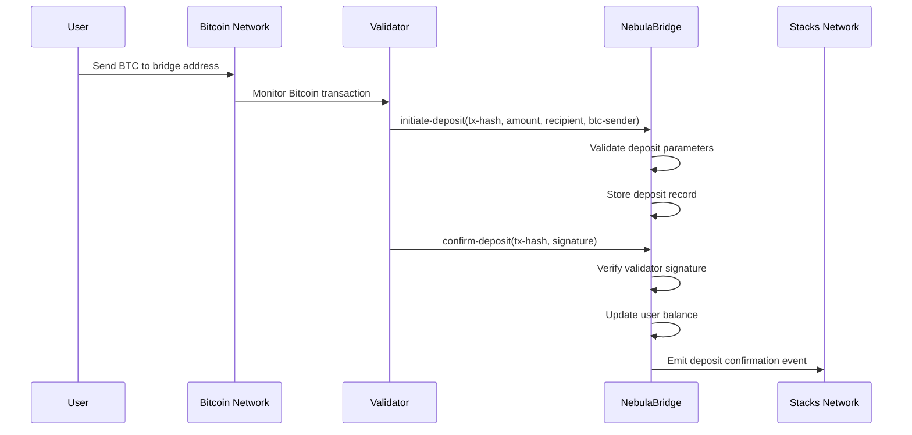
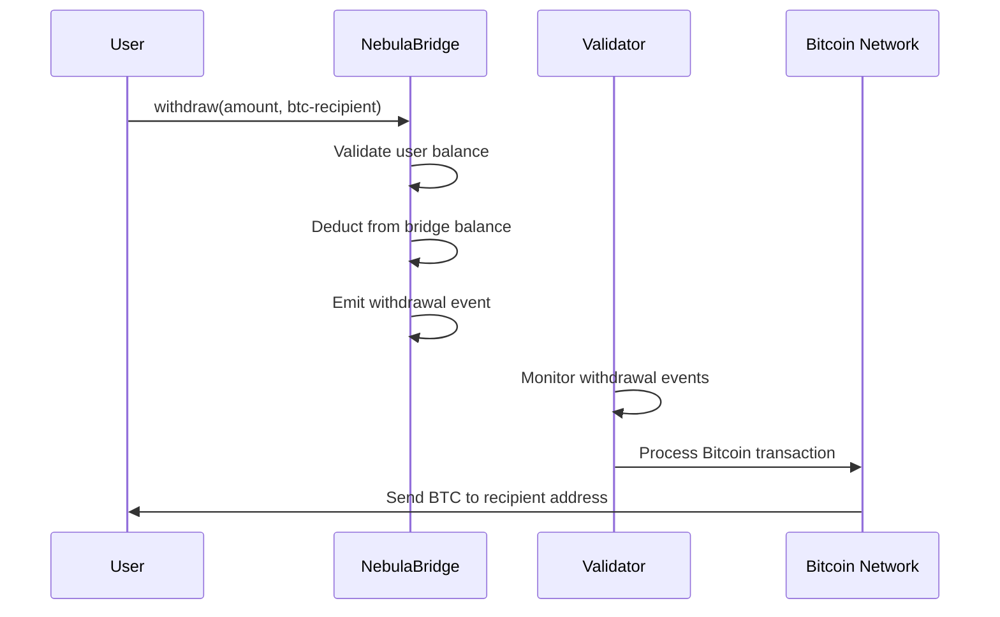

# NebulaBridge Protocol

[](https://opensource.org/licenses/ISC)
[](https://docs.stacks.co/clarity)
[](https://stacks.co)

## Overview

NebulaBridge is a decentralized cross-chain asset gateway designed to enable seamless and verifiable transfers between Bitcoin and Stacks. The protocol ensures that digital value moves securely across chains without centralized custody or reliance on trusted intermediaries.

This institutional-grade bridge combines multi-signature validation, fraud detection mechanisms, and emergency safeguards to deliver enterprise-level security for cross-chain participants.

## Architecture

### System Overview

```
Bitcoin Network          NebulaBridge Protocol          Stacks Network
     │                            │                           │
     │    ┌─────────────┐         │         ┌─────────────┐    │
     │────┤ BTC Deposit │────────►│────────►│ Mint Assets │────┤
     │    └─────────────┘         │         └─────────────┘    │
     │                            │                           │
     │                     ┌──────▼──────┐                    │
     │                     │ Validator   │                    │
     │                     │ Network     │                    │
     │                     └──────┬──────┘                    │
     │                            │                           │
     │    ┌─────────────┐         │         ┌─────────────┐    │
     │────┤ BTC Release │◄────────│◄────────┤ Burn Assets │────┤
     │    └─────────────┘         │         └─────────────┘    │
     │                            │                           │
```

### Contract Architecture

The NebulaBridge protocol consists of the following core components:

#### 1. **Validator Network**

- Decentralized network of trusted validators
- Multi-signature consensus mechanism (N-of-M model)
- Replay protection and signature verification
- Dynamic validator management by contract deployer

#### 2. **Deposit Pipeline**

- Two-phase deposit process: initiation and confirmation
- Bitcoin transaction validation
- Cross-chain address verification
- Configurable confirmation requirements

#### 3. **Withdrawal Pipeline**

- User-initiated withdrawal requests
- Automatic balance verification
- Bitcoin address validation
- Event emission for off-chain processing

#### 4. **Security Controls**

- Circuit breaker mechanism (pause/resume functionality)
- Emergency withdrawal capabilities
- Strict amount validation (min/max limits)
- Comprehensive error handling

## Data Flow

### Deposit Flow (Bitcoin → Stacks)



### Withdrawal Flow (Stacks → Bitcoin)



## Key Features

### 🔐 **Security Features**

- **Multi-signature Validation**: N-of-M validator consensus model
- **Replay Protection**: Prevents duplicate transaction processing
- **Circuit Breaker**: Emergency pause functionality
- **Address Validation**: Cross-chain address verification
- **Range Enforcement**: Configurable min/max deposit limits

### ⚡ **Operational Features**

- **Dynamic Controls**: Real-time bridge management
- **Emergency Recovery**: Deployer-controlled emergency withdrawals
- **Balance Tracking**: Real-time bridged asset accounting
- **Event Logging**: Comprehensive transaction logging

### 🛡️ **Fraud Prevention**

- **Signature Verification**: Cryptographic validation of all transactions
- **Confirmation Requirements**: Configurable Bitcoin confirmation depth
- **Duplicate Prevention**: Protection against replay attacks
- **Validator Authentication**: Strict validator authorization

## Protocol Constants

| Constant | Value | Description |
|----------|-------|-------------|
| `MIN_DEPOSIT_AMOUNT` | 100,000 | Minimum deposit amount (in satoshis) |
| `MAX_DEPOSIT_AMOUNT` | 1,000,000,000 | Maximum deposit amount (in satoshis) |
| `REQUIRED_CONFIRMATIONS` | 6 | Required Bitcoin confirmations |

## Public Functions

### Administrative Functions

#### `initialize-bridge()`

Initializes the bridge protocol. Can only be called by the contract deployer.

#### `pause-bridge()`

Pauses all bridge operations. Emergency function callable only by deployer.

#### `resume-bridge()`

Resumes bridge operations after pause. Callable only by deployer.

#### `add-validator(validator: principal)`

Adds a new validator to the network. Deployer-only function.

#### `remove-validator(validator: principal)`

Removes a validator from the network. Deployer-only function.

### Core Bridge Functions

#### `initiate-deposit(tx-hash, amount, recipient, btc-sender)`

Initiates a cross-chain deposit. Called by validators after detecting Bitcoin deposits.

**Parameters:**

- `tx-hash`: Bitcoin transaction hash (32 bytes)
- `amount`: Deposit amount in satoshis
- `recipient`: Stacks address to receive bridged assets
- `btc-sender`: Bitcoin sender address (33 bytes)

#### `confirm-deposit(tx-hash, signature)`

Confirms a deposit with validator signature. Multi-signature consensus required.

**Parameters:**

- `tx-hash`: Bitcoin transaction hash
- `signature`: Validator signature (65 bytes)

#### `withdraw(amount, btc-recipient)`

Initiates withdrawal to Bitcoin network.

**Parameters:**

- `amount`: Amount to withdraw
- `btc-recipient`: Bitcoin recipient address (34 bytes)

#### `emergency-withdraw(amount, recipient)`

Emergency withdrawal function. Deployer-only for crisis situations.

## Read-Only Functions

| Function | Description |
|----------|-------------|
| `get-deposit(tx-hash)` | Retrieves deposit information by transaction hash |
| `get-bridge-status()` | Returns current bridge pause status |
| `get-validator-status(validator)` | Checks if address is authorized validator |
| `get-bridge-balance(user)` | Returns user's bridged asset balance |
| `validate-deposit-amount(amount)` | Validates deposit amount against limits |

## Error Codes

| Code | Error | Description |
|------|-------|-------------|
| 1000 | `ERROR-NOT-AUTHORIZED` | Unauthorized access attempt |
| 1001 | `ERROR-INVALID-AMOUNT` | Invalid transaction amount |
| 1002 | `ERROR-INSUFFICIENT-BALANCE` | Insufficient balance for operation |
| 1003 | `ERROR-INVALID-BRIDGE-STATUS` | Invalid bridge state for operation |
| 1004 | `ERROR-INVALID-SIGNATURE` | Invalid validator signature |
| 1005 | `ERROR-ALREADY-PROCESSED` | Transaction already processed |
| 1006 | `ERROR-BRIDGE-PAUSED` | Bridge is currently paused |
| 1007 | `ERROR-INVALID-VALIDATOR-ADDRESS` | Invalid validator address |
| 1008 | `ERROR-INVALID-RECIPIENT-ADDRESS` | Invalid recipient address |
| 1009 | `ERROR-INVALID-BTC-ADDRESS` | Invalid Bitcoin address format |
| 1010 | `ERROR-INVALID-TX-HASH` | Invalid transaction hash format |
| 1011 | `ERROR-INVALID-SIGNATURE-FORMAT` | Invalid signature format |

## Development

### Prerequisites

- [Clarinet](https://github.com/hirosystems/clarinet) - Stacks development environment
- Node.js 18+ and npm
- Git

### Installation

```bash
# Clone the repository
git clone https://github.com/samuelasikpo/nebula-bridge.git
cd nebula-bridge

# Install dependencies
npm install

# Check contract syntax
clarinet check

# Run tests
npm test
```

### Testing

The project includes comprehensive test coverage using Vitest and Clarinet SDK:

```bash
# Run all tests
npm run test

# Run tests with coverage report
npm run test:report

# Watch mode for development
npm run test:watch
```

### Contract Validation

```bash
# Check contract syntax and types
clarinet check

# Format contract code
clarinet fmt --in-place
```

## Deployment

### Testnet Deployment

1. Configure your Stacks wallet for testnet
2. Update `settings/Testnet.toml` with your configuration
3. Deploy using Clarinet:

```bash
clarinet deployments apply --mainnet
```

### Mainnet Deployment

⚠️ **Important**: Thoroughly test on testnet before mainnet deployment.

1. Configure `settings/Mainnet.toml`
2. Deploy with proper security reviews:

```bash
clarinet deployments apply --mainnet
```

## Security Considerations

### Operational Security

- **Validator Key Management**: Secure storage and rotation of validator private keys
- **Multi-signature Coordination**: Proper coordination mechanisms for validator consensus
- **Emergency Procedures**: Clear protocols for emergency situations
- **Monitoring**: Continuous monitoring of cross-chain transactions

### Smart Contract Security

- **Access Control**: Strict permission management for administrative functions
- **Input Validation**: Comprehensive validation of all user inputs
- **State Management**: Careful handling of contract state transitions
- **Error Handling**: Robust error handling and recovery mechanisms

### Bridge Security

- **Confirmation Requirements**: Adequate Bitcoin confirmation depth
- **Validator Consensus**: Sufficient validator participation for security
- **Circuit Breakers**: Emergency pause mechanisms for anomaly detection
- **Amount Limits**: Reasonable transaction size limits

## License

This project is licensed under the ISC License - see the [LICENSE](LICENSE) file for details.

## Contributing

1. Fork the repository
2. Create your feature branch (`git checkout -b feature/amazing-feature`)
3. Commit your changes (`git commit -m 'Add some amazing feature'`)
4. Push to the branch (`git push origin feature/amazing-feature`)
5. Open a Pull Request

## Support

For questions, issues, or contributions, please open an issue on GitHub or contact the development team.
